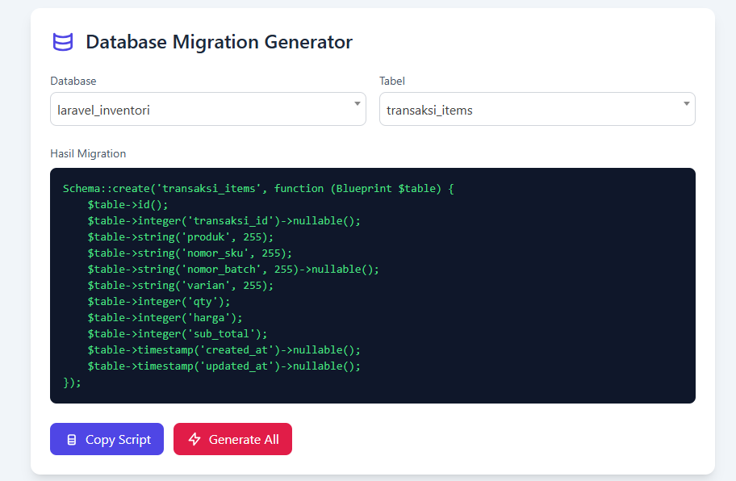
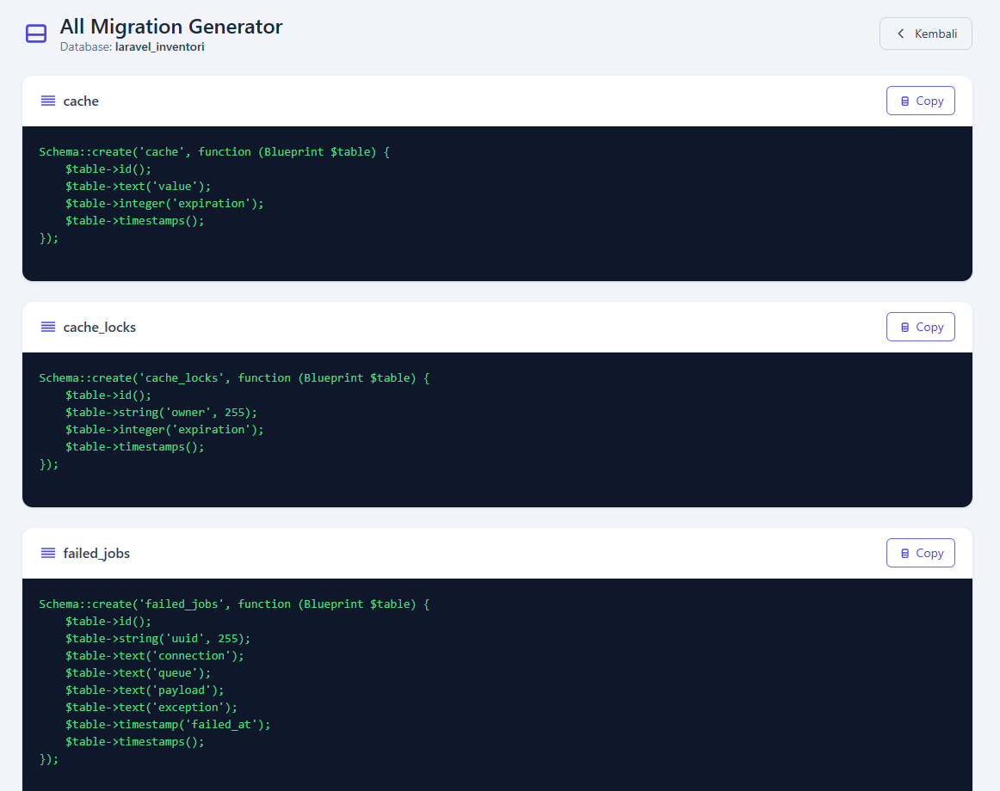

# Database Migration Generator

Tool berbasis web untuk **generate migration Laravel** dari **database MySQL yang sudah ada**.  
Dibuat untuk mempermudah proses migrasi database lama (legacy) ke project Laravel tanpa harus nulis schema satu per satu.

---

## ✨ Fitur

- 🔹 Pilih database secara dinamis
- 🔹 Daftar tabel otomatis sesuai database yang dipilih
- 🔹 Generate migration per tabel
- 🔹 Generate migration **semua tabel dalam satu database**
- 🔹 Hasil migration rapi dan mudah dibaca
- 🔹 Copy script migration langsung ke clipboard
- 🔹 Tampilan sederhana (Bootstrap + Select2)

---

## 🎯 Kegunaan

Tool ini cocok digunakan jika kamu:

- Punya database MySQL lama
- Ingin rebuild / migrasi project ke Laravel
- Tidak ingin menulis migration secara manual
- Bekerja dengan banyak database atau struktur tabel besar

---

## 🛠️ Teknologi yang Digunakan

- **MySQL**
- **Tailwind CSS**
- **jQuery**
- **Select2**

---

## 🚀 Cara Kerja Singkat

1. Pilih database
2. Pilih tabel (atau generate semua tabel)
3. Script migration akan digenerate otomatis
4. Copy hasilnya dan simpan ke file migration Laravel

---

## 📸 Preview

|           Migrasi per Tabel           |
| :-----------------------------------: |
|  |

|          Migrasi Semua Tabel           |
| :------------------------------------: |
|  |

---

## ⚠️ Catatan

- Tool ini membaca struktur database langsung dari MySQL
- Direkomendasikan untuk penggunaan development
- Menggunakan query seperti `SHOW DATABASES`, `SHOW TABLES`, dan `SHOW COLUMNS`

---

## 📌 Rencana Pengembangan

- [ ] Deteksi foreign key
- [ ] Support enum dan default value
- [ ] Download migration sebagai file `.php`
- [ ] Generate nama file migration otomatis
- [ ] Support database selain MySQL

---

## 🤝 Kontribusi

Kontribusi sangat terbuka.  
Silakan fork repository ini, buat issue, atau ajukan pull request.

---

## 📄 Lisensi

MIT License
